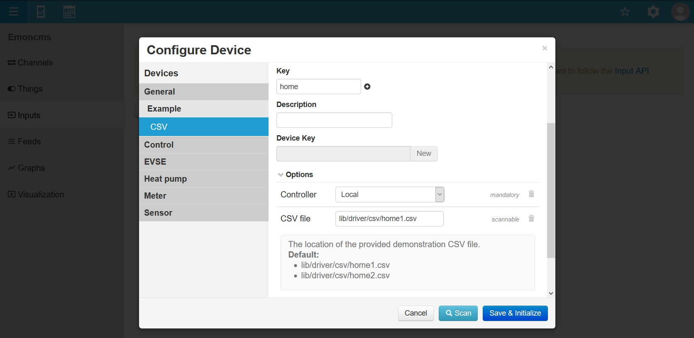
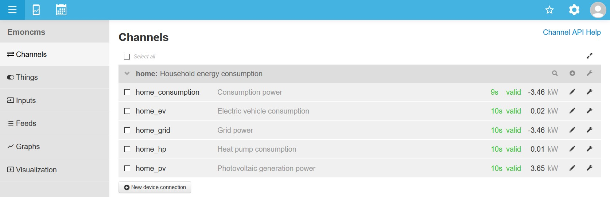
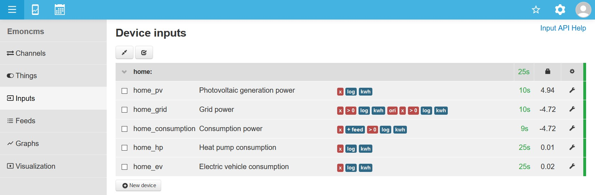

This document describes the first steps with emonmuc (**E**nergy **mon**itoring **M**ulty **U**tility **C**ommunication controller), an open-source protocoll driver project to enable the communication with a variety of metering or other devices, developed based on the [OpenMUC](https://www.openmuc.org/) project.

---------------

# 1 Setup

With both components installed and running, an OpenMUC framework controller was registered to the emoncms user. This can be verified in the **Controllers** page, accessible at the users **My Account** from the menu.

Click *Multiy Utility Communication* **Configure** pencil icon and verify the default settings, if the framework is running on the same machine.

Further, the following guide will expect the use of the Beta version, as well as the emoncms [device module](https://github.com/emoncms/device).  
Energy meters and other utility devices connected to the local platform can now be configured in the **Channels** site.  
Each emoncms user may have several emonmuc controllers registered, located e.g. in different locations of the building and aggregated into one platform.

# 2 Overview

To get a first orientation in the framework, the following section provides a quick overview regarding the structure and terminology.

## 2.1 Emoncms

[Emoncms](https://emoncms.org/) (**E**nergy **mon**itoring **C**ontent **M**anagement **S**ystem) is an open-source web-app for processing, logging and visualising energy, temperature and other environmental data and part of the [OpenEnergyMonitor](https://openenergymonitor.org/) project.

Additionally to this short summary, official [User Guides](https://emoncms.org/site/api#userguides) can be looked at.

- **Feeds**: (Feed) A place where data is recorded, a time-series of datapoints. The standard time-series databases used by emoncms are PHPFina and PHPTimeSeries and where written as part of the emoncms project.
- **Inputs**: An incoming datasource. Each input has an associated "node" identifier and a "key" sub-identifier. Inputs are entry points, only the last value and time of the input is recorded. To record historic data a feed needs to be created from an input.
  - **Node**: A grouping identifier for inputs or feeds.
  - **Key**: A sub-identifier for items within each Node.
  - **Process list** (or input processing): A list of processes performed sequentially on each input value as it is received on that input.
  - **Process**: A function that can be attached to the process list of an input to change the value or to save the value to a feed.
- **Devices**: As part of the emoncms [device module](https://github.com/emoncms/device), devices provide templates to automatically configure a set of feeds, inputs, channels or specific mappings to control e.g. household appliances.

## 2.2 Emonmuc

Emonmuc provides a GUI integration of the [OpenMUC](https://www.openmuc.org/) (**Open** **M**ulti **U**tility **C**ommunication) Controller project, which is being developed by the German Frauenhofer Institute for Solar Energy Systems ISE. MUC Controllers are the core of the German smart metering standardization process and serve as concentrators of energy or other environment meters. This concentrated data may then be processed or forwarded to energy suppliers. In Germany, the MUC-FNN and the Open Metering committees work on that subject and the OpenMUC project gets developed to provide an open and accessible implementation of those standards functionalities.  
The project and knowledge gained in its development served as groundwork and the Institutes main contribution towards the [OGEMA](http://www.ogema.org/) project in 2011. Thus, it shares a lot of architecture aspects and is highly compatible with OGEMA modules. 

- (Device) **Connections**: Independent of emoncms devices, connections may represent e.g. separate metering units or a cable bus system, depending on its protocol driver. Each connection can configure several channels.

- **Channels**: Channels represents single data points, representing e.g. the metered active power of a smart meter, the temperature of a temperature sensor, any value of digital or analog I/O modules or the manufacture data of the device.  
  If configured to log sampled data, values will be written into inputs for the same key, to allow further processing.

## 2.3 Navigation

The header navigation bar provides the access to all important emoncms pages. Additionally to the **Channels**, **Inputs** and **Feeds**, the dropdown menues contain the following noteworthy entries:

### Setup

- **My Account**: Here you get information about your Profile. You can edit your username, password, E-mail and access your [API Keys](https://cloud.google.com/endpoints/docs/openapi/when-why-api-key) (for *read* and *write* access).

- **Administration**: See and edit users, update the database (Necessary to run after updating emoncms, after installing a new module or to check emoncms database status), Logger, Server-, and Client Information.

### Extra

- **Things**: Corresponding to emoncms devices, prepared templates may provide mappings to e.g. a configured channel that represents a GPIO on a Raspberry Pi. Such a device will be shown as a **Thing**, allowing the user to e.g. comfortably switch connected LEDs High or Low.

# 3 CSV driver example

To get a first impression of channels, inputs and feeds, the **CSV** driver provides a set of example files. The driver enables the read-in of logged CSV values, in this particular case the metered energy consumption of a household.  
With the help of the device module, a demonstration configuration may be setup in a few steps.

First, the driver needs to be installed. This can be done with the simple shell command

~~~
emonmuc install csv
~~~

After restarting the framework, add a new Device Connection (representing a specified CSV file in this case) by opening the input view **Setup > Inputs** and pressing the "New device" button.

## 3.1 Configure Device

First, select the prepared device template, selectable in the sidebar under **Demonstration > CSV > Home**.

After configuring a *Node* and a *Name*, the path to the CSV file is mandatory. There are two ways of choosing the file: Either to simply type it in, or some drivers allow the scanning of devices.  
The scan button for the **Home** device allows the selection of the provided example CSV files.

When clicking scan, you might get to choose between two file paths.  
After selecting one of them by clicking its name, **Save** and **Initialize** the device.

The initialization will prepare each 6 channels and inputs, as well as 12 feeds and a set of processes.

## 3.2 Channels

In this case of the CSV driver, each channel represents the column of the selected file. Both the device connection, as well as the single channels may be configured by clicking its corresponding wrench icon.

The channel configuration allows the specification of the channel according to its driver. In this case, only a **Channel address > Column header** is necessary, but other drivers require more detailed configurations depending on their complexity.  
Additionally, the *Logging settings* configure the link between channels and emoncms inputs, like the **Logging(Posting) Interval**, after which a sampled value is posted to its corresponding input.

Additional information about each option can be aquired by clicking anywhere on its row.

## 3.3 Inputs

In the input view, the automatically configured inputs and a set of processes can be explored. Each input corresponds to its channel with identical key.  
The wrench icon on the right of each input allows the detailed configuration of processes.

The processes in this example include e.g. for *home_pv_generation_power*:

- **x**: Mathematical multiplication operator. Here, every value is multiplied with 1000, as the power values read from the CSV file come in *kW* and further processing requires the [SI unit](https://en.wikipedia.org/wiki/International_System_of_Units) Watts.
- **log**: Logs the power value in Watts to a specified feed.
- **kwh**: Accumulates and counts the power to consumed energy and logs it into a specified feed.

## 3.4 Feeds

The feed view allows the configuration of specific feeds and shows the latest value received.  
Each channel resulted in two feeds, both power and energy. This approach allows very quick visualizations even on embedded systems.

Clicking on a feed (or selecting several feeds and selecting the eye icon) shows its historic visualization.

### 3.4.1 Graph

After allowing the CSV driver to post values for some hours, the data can be explored in the graph view like shown here:

# 4 Next Step

The [next guide](FirstStepsGpio.md) explores a more practical application. It documents the connecting and switching of a LED via Raspberry Pi GPIO pins.

