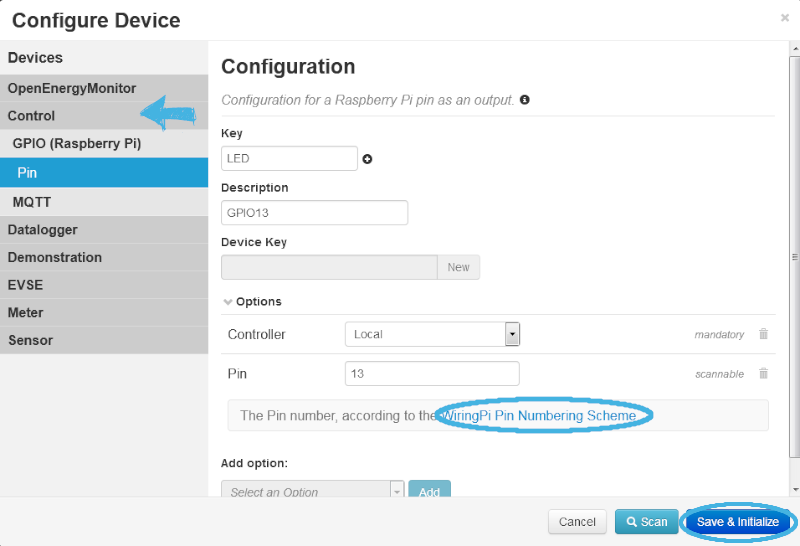
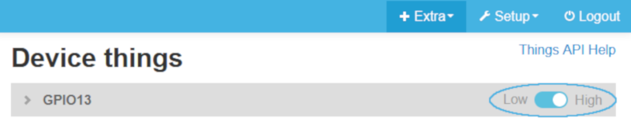

This document describes the configuration and control of a LED via Raspberry Pi GPIO pins with emonmuc (**E**nergy **mon**itoring **M**ulty **U**tility **C**ommunication controller).

---------------

# 1 Installation

To setup this driver, [emonmuc](https://github.com/isc-konstanz/emonmuc/) needs to be installed. To do so, a comprehensive guide is provided on the projects GitHub page.

With emonmuc being installed, the driver may be enabled

~~~
emonmuc install rpi-gpio
~~~

To disable the driver, use

~~~
emonmuc remove rpi-gpio
~~~

The GPIO driver is based on the [Pi4J](https://www.pi4j.com/) library, that links to the [Wiring Pi](http://wiringpi.com/) debian package.  
To prepare it, the [Wiring Pi preparation guide](LinuxWiringPi.md) needs to be followed.

## 1.1 Assembling the hardware

Now, connect a LED via a GPIO pin: next to the Raspberry Pi you need a breadboard or something similar, some wires (Female-Male), a LED and a resistor (e.g. 420 Ohm, depending on your LED), as shown in the first image. If you are not sure, how high your resistance is, go check it out [here](https://www.digikey.com/en/resources/conversion-calculators/conversion-calculator-resistor-color-code-4-band).

Next, connect one wire (black) from the ground-pin to the breadboard. Connect the resistor and the LED with the board in series. Last step is to link the second wire (orange) with any pin (here, it is pin 21, GPIO 13).

*Note: The GPIO 13 was randomly chosen. Any GPIO-Pin is programmable.*

# 2 Configure Device

Create a *New device* in the device view and select its type **Control > GPIO (Raspberry Pi) > Pin**. Enter a *Key* and optional a *Description*, as well as the number of the priorly chosen pin.

**Caution**: Pins are sorted according to the [WiringPi Pin Numbering Scheme](https://pi4j.com/1.4/pin-numbering-scheme.html). This might be different to the numbering you know from former projects!

If done, click **Save and Initialize**. 

# 3 Switch the LED

Now, navigate to the thing view via **Extra > Things**, to get a very basic block with one switch button:

With it, simply turn the LED On and Off by toggling the button. Did you do everything correct? Congratulations!  
The graph view shows you the history of the LED status: 1 equals high, 0 equals low.
