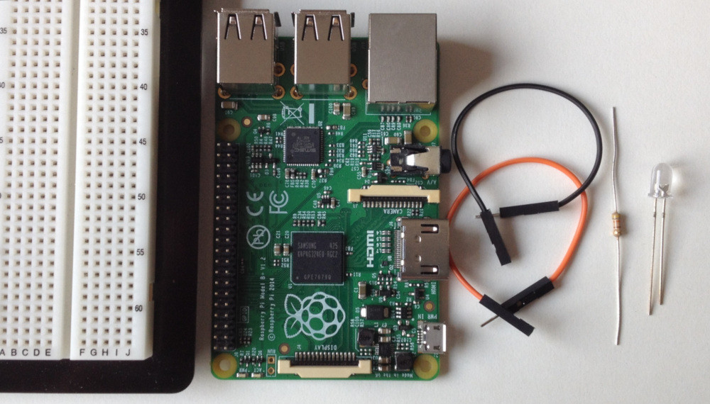
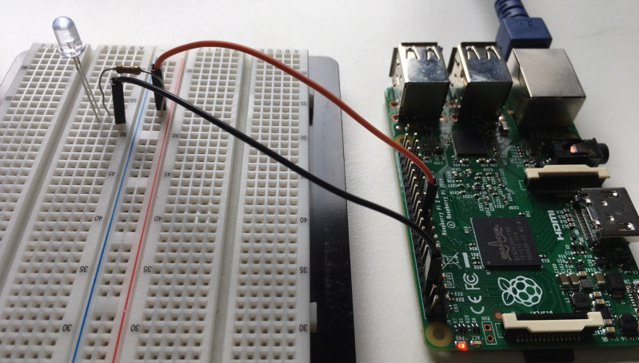
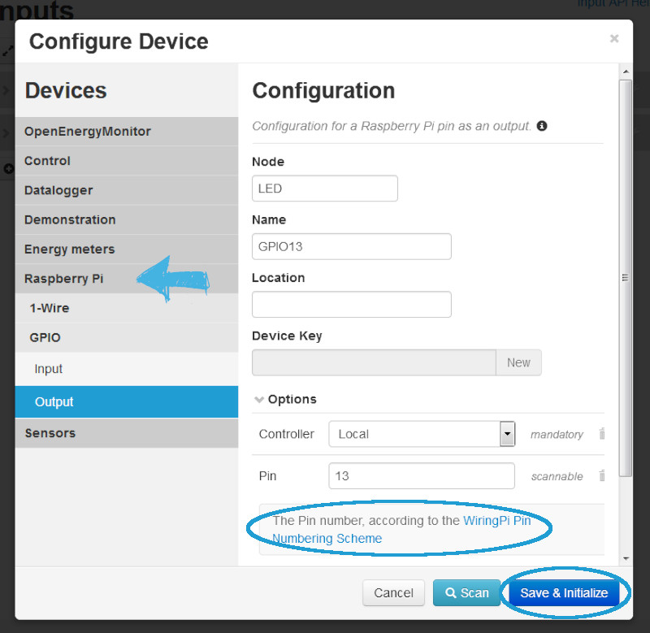
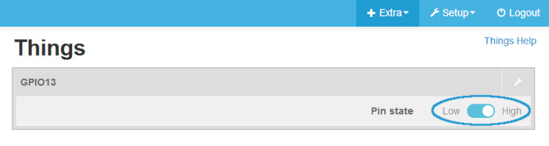

This document describes the configuration and control of a LED via Raspberry Pi GPIO pins with emonmuc (**E**nergy **mon**itoring **M**ulty **U**tility **C**ommunication controller).

---------------

# 1 Installation

To setup this driver, [emonmuc](https://github.com/isc-konstanz/emonmuc/) needs to be installed. To do so, a comprehensive guide is provided on the projects GitHub page.

With emonmuc being installed, the driver may be enabled

~~~
emonmuc install csv
~~~

To disable the driver, use

~~~
emonmuc remove csv
~~~

To allow drivers to have access to GPIO pins of the Raspberry Pi even when not root, non-privileged accessed can be enabled since the Raspberry Pi 3.  
Non-privileged access for GPIO is not enabled by default due to the fact that some functions such as PWM are not yet supported in a non-privileged context.

This can be done by simply appending a value to the users path variable in `~/.bashrc`:  
*Beware that this change needs the user to logout to take effect*

>    export WIRINGPI_GPIOMEM=1

To make sure, check that `ls -l /dev/gpiomem` returns the correct permissions

>    crw-rw---- 1 root gpio 248, 0 MM DD HH:mm /dev/gpiomem

If it doesn't, set the correct permissions:

~~~
sudo chown root.gpio /dev/gpiomem
sudo chmod g+rw /dev/gpiomem
~~~

**Caution**: Non-priviledged access only works since the Raspberry Pi 3 and onwards. Older platforms need to start the emonmuc framework with root permissions.  
To do so, simply change the ownership of the runscript and restart the framework:

~~~
sudo chown root -R /opt/emonmuc/bin
sudo systemctl restart emonmuc
~~~

## 1.1 Assembling the hardware

Now, connect a LED via a GPIO pin: next to the Raspberry Pi you need a breadboard or something similar, some wires (Female-Male), a LED and a resistor (e.g. 420 Ohm, depending on your LED), as shown in the first image. If you are not sure, how high your resistance is, go check it out [here](http://www.dieelektronikerseite.de/Tools/Widerstandsrechner.htm).

Next, connect one wire (black) from the ground-pin to the breadboard. Connect the resistor and the LED with the board in series. Last step is to link the second wire (orange) with any pin (here, it is pin 21, GPIO 13).

*Note: The GPIO 13 was randomly chosen. Any GPIO-Pin is programmable.*

# 2 Configure Device

Create a *New device* in the input view and select its type **Raspberry Pi > GPIO > Output** (to allow the switching of the LED, it needs to be an output). Enter a *Node* and a *Name*, as well as the number of the priorly chosen pin.

**Caution**: Pins are sorted according to the [WiringPi Pin Numbering Scheme](http://pi4j.com/pin-numbering-scheme.html). This might be different to the numbering you know from former projects!

If done, click **Save and Initialize**. 

# 3 Switch the LED

Now, navigate to the thing view via **Extra > Things**, to get a very basic block with one switch button:

With it, simply turn the LED On and Off by toggling the button. Did you do everything correct? Congratulations!  
The graph view shows you the history of the LED status: 1 equals high, 0 equals low.
