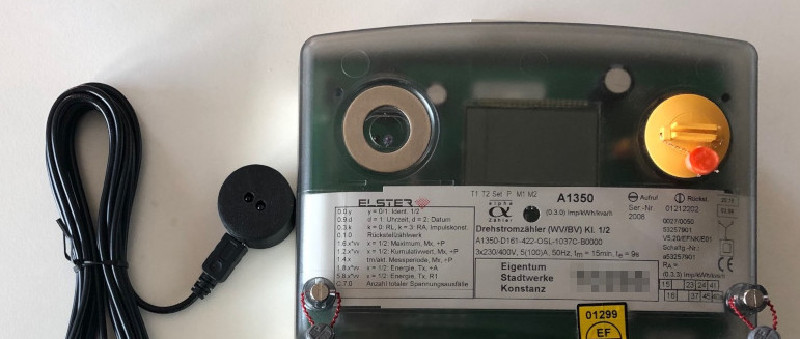
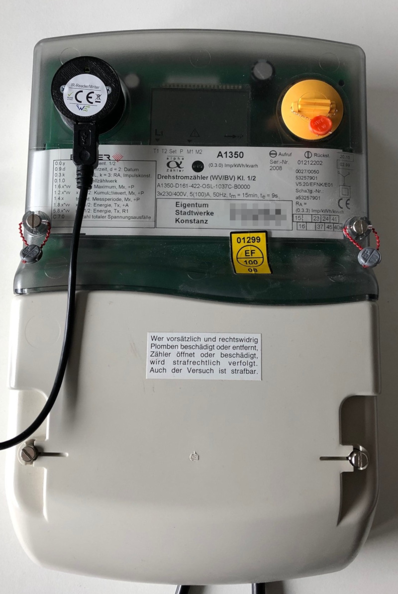
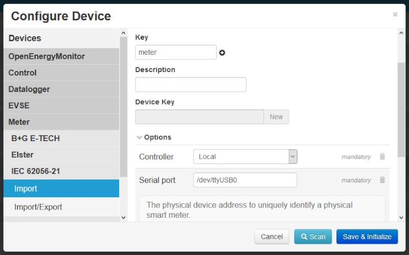
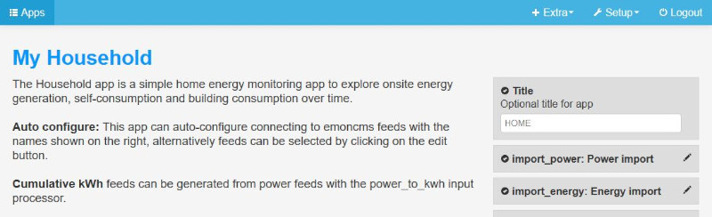
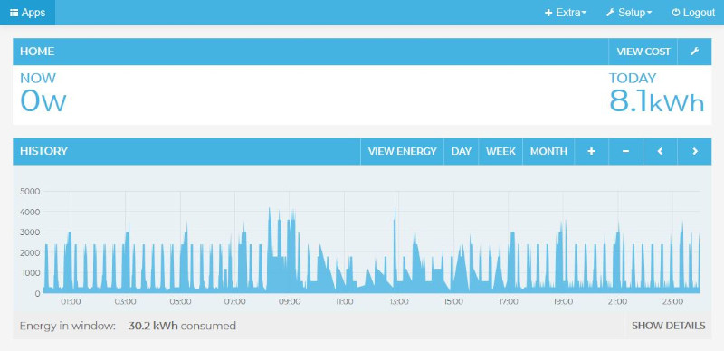

This document describes the configuration of an electric household meter via an IR probe with emonmuc (**E**nergy **mon**itoring **M**ulty **U**tility **C**ommunication controller).

Knowing about the energy consumption or exploring renewable energy generation of your home in the context of zero carbon is a primary goal of the [OpenEnergyMonitor](https://openenergymonitor.org/) project to be available easily for as many people as possible. Modern electronic domestic supply meters provide an interface with the IEC 62056-21 protocol, for network operators to manually read the households consumption. While IEC 62056-21 is designed to operate over any media, including the Internet, most meters usually use modulated light, sent with an LED and received with a photodiode. These can be spotted on the meter quite easily and can be used without the need of any further electrical installation by anyone.

---------------

# 1 Installation

To setup the necessary driver, [emonmuc](https://github.com/isc-konstanz/emonmuc/) needs to be installed. To do so, a comprehensive guide is provided on the projects GitHub page.

With emonmuc being installed, the driver may be enabled

~~~
emonmuc install iec62056p21
~~~

To disable the driver use

~~~
emonmuc remove iec62056p21
~~~

To conclude, the [Serial Port should be prepared](https://github.com/isc-konstanz/emonmuc/blob/master/docs/LinuxSerialPort.md) accordingly.

## 1.1 Assembling the hardware

Connect the serial port, e.g. the IR probe, to the Raspberry Pi. Make sure to place the magnetic read/write head at the intended position. Be aware to place it exactly, as the LED and photodiode need to be aligned correctly to transmit any data.

# 2 Configure Device

Create a *New device* in the device view and select its type **Meter > IEC 62056-21 > Import**. Enter a *Key* and optional a *Description*, as well as the address of the serial port. If an IR probe was plugged in via an USB interface, the address would commonly be ``/dev/ttyUSB0``.  
If a PV system is installed and the meter is configured to be bidirectional, the **Import/Export** template should be selected.

**Notice:** optionally, the OBIS code of the registers can be configured manually, if the meter uses different registers as the default value 1.8.0. For meters with several tariffs (e.g. day and night tariffs), the main register can be 1.8.1, but commonly this can be verified on a registers table printed on the meter. For bidirectional meters (household with a solar system), the default OBIS code for the export register is 2.8.0.

When done, click **Save and Initialize**.

By default, values are getting requested once every minute. When everything has been setup correcty, metered values can be shown in the Feeds view.

# 3 Household application

With the metered data stored in the local database, some visualizations and tools to explore the household consumption can be used. Emoncms provides the [app module](https://github.com/emoncms/app), that can be installed for this purpose.

For example, install and add a new app like **My Household**

Only *import_power* and *import_energy* are mandatory configurations, that can be chosen to be the newly created feeds accordingly.  
To allow a more detailed exploration of consumed energy costs, the correct energy tariff should be configured as well.

After a while, the housholds consumption can be viewed both in high resolution power values, as well as accumulated energy.

By selecting **view cost** at the top header, the same time periods may be explored while showing the price of the consumed energy. If a solar system is installed and correctly configured, a feed-in tariff will be taken into account as well.

