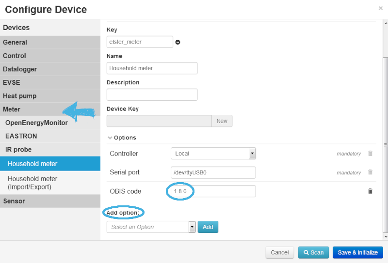
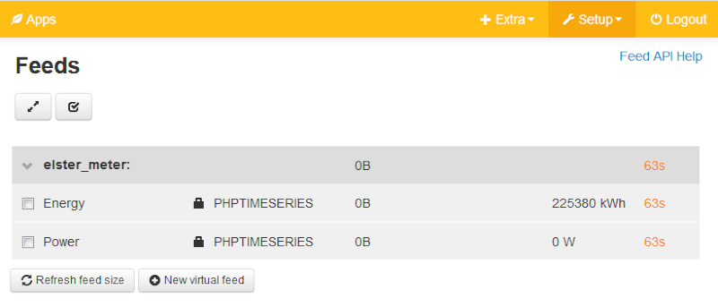

This document describes the configuration and control of a (bidirectional) household meter via IR probe with emonmuc (**E**nergy **mon**itoring **M**ulty **U**tility **C**ommunication controller).

---------------
To know the power consumption of your home is very interesting and can show you, if installed, the export of your solar system. 
The household meter above is the commonly installed meter in Germany. Look at your household meter: If you can see a circular deepening where two LEDs can be spotted, the only thing you need to buy is an [IR probe](https://www.amazon.de/Weidmann-Elektronik-Stromz%C3%A4hler-Infrarot-Lesekopf/dp/B01B8N0ASY/ref=sr_1_1?ie=UTF8&qid=1548773180&sr=8-1&keywords=IR+Stromz%C3%A4hler).

Download the driver

~~~
emonmuc install iec62056p21
~~~

To disable the driver use

~~~
emonmuc remove iec62056p21
~~~

If not already done, [prepare the Serial Port](https://github.com/isc-konstanz/emonmuc/blob/master/docs/LinuxSerialPort.md).
Plug in the IR probe to your Raspberry and place the magnetic read/write head at the intended position. Be aware to place it at the exact position, otherwise there can't be any data transmitted.

Now create a new device and select **Meter > IR probe > Household meter or Household meter (Import/Export)**. Only take the Household meter (Impoert/Export) if you have a PV installed. In this case you also export energy and have a bidirectional meter.
Choose a key, a name and a desription as you like. In options you mandatorily have to name the Serial port. By clicking at this point an explanation opens and shows two possibilities. In our example we use the /dev/ttyUSB0 because we connect the probe via USB, not with the UART pins of the Raspberry.
Add the option OBIS code, to select the ID of the import data set. The default is 1.8.0 When you are not sure about your ID, have a look at the registers of your household meter. Only for the bidirectional meter (household with solar system) you have to add another option: OBIS code export. The default is 2.8.0

When done click **Save & Initialize**

Go to Channels and have a look if the Energy Meter is getting some values. The values are getting measured every minute so be a bit patient. When everything has been done correcty, the Feeds view should look something like this: 

