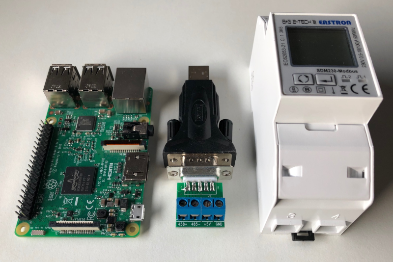
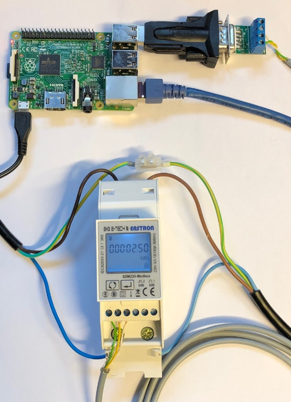
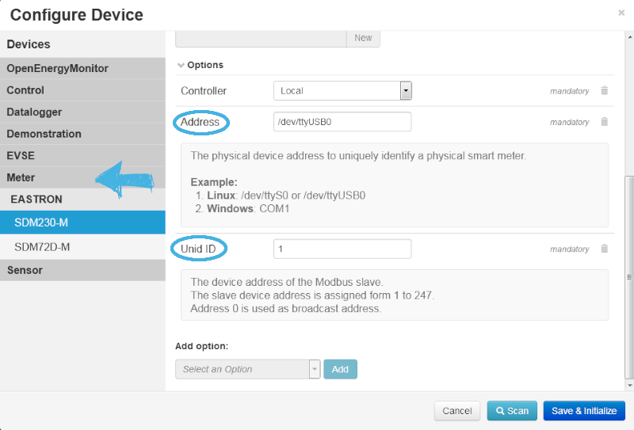
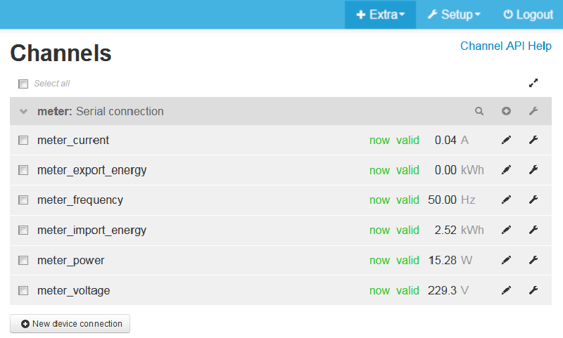
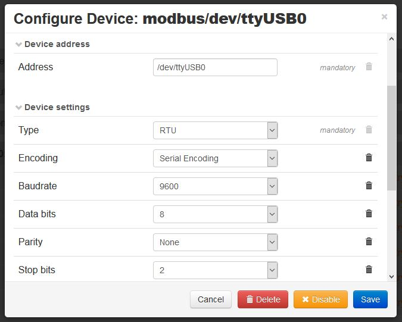
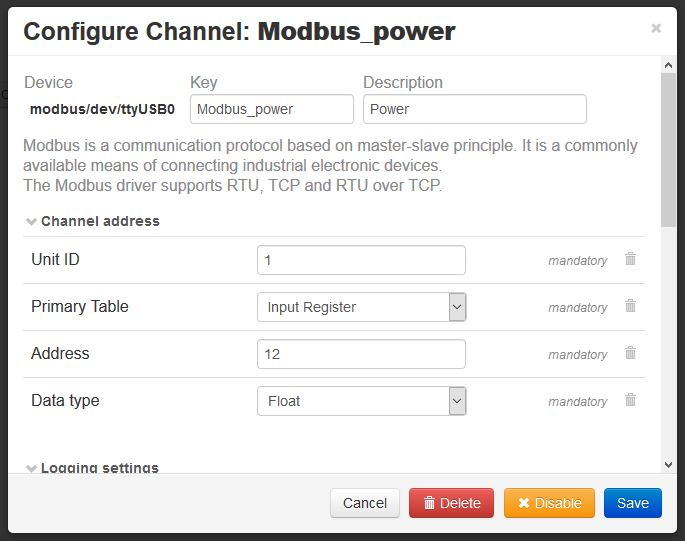

This document describes the configuration of a Modbus Single Phase Energy Meter with emonmuc (**E**nergy **mon**itoring **M**ulty **U**tility **C**ommunication controller). The versatile modbus protocol can be used to show how to manually configure an [OpenMUC](https://openmuc.org) protocol driver.

---------------

# 1 Installation

To setup this driver, [emonmuc](https://github.com/isc-konstanz/emonmuc/) needs to be installed. To do so, a comprehensive guide is provided on the projects GitHub page.

With emonmuc being installed, the driver may be enabled

~~~
emonmuc install modbus
~~~

To disable the driver, use

~~~
emonmuc remove modbus
~~~

## 1.1 Install RXTX 

RXTX is a Java native library providing serial and parallel communication for the Java virtual machine. It is a necessary dependency for many communication devices, using e.g. RS485.

To install, download the binaries via debian repository:

~~~
sudo apt-get install librxtx-java
~~~

If the serial port is not connected to the Raspberry Pi via e.g. an USB interface but the Raspberrys internal UART pins, the [Serial Port should be prepared](https://github.com/isc-konstanz/emonmuc/blob/master/docs/LinuxSerialPort.md) accordingly.

## 1.2 Assembling the hardware

**Please be aware, that working with domestic energy supply cables in the wrong way can cause death by high voltage! The guide given here has to be used at your own risk.**

For this simple demonstration, an EASTRON SDM230 Modbus RTU single phase energy meter was used, additional to a serial RS485 converter from Digitus.
This guide tries to encourage to use any modbus device though, to get accustomed with. 

 

# 2 Configure Channels

If a SDM230-M device is available, a *New device* may be created in the device view and its type **Meter > EASTRON > SDM230-M** selected. Enter a *Key* and optional a *Description*, as well as the address of the serial port, here ``/dev/ttyUSB0``. Additionally, the modbus unit ID needs to be specified. The address will be 1 by default and can be viewed and changed in the meter configuration, if several devices are connected to the same serial bus.

When done, click **Save & Initialize**

If no device template is available for the modbus device, its registers can be configured manually in the Channels view. The main purpose of device templates, like the *SDM230-M*, is to automatically configure a set of channels/registers, inputs and feeds. To get a closer look at channels and how to configure them, it may be useful to use those as a reference point for further steps. 

## 2.1 About the Modbus protocol

To understand the numbering and addressing of the Modbus protocol and to be able to address the right register a short overview may be helpful: 

The Modbus protocol is based on a master/slave architecture. A master can be connected with several slaves.
For this example, the Modbus RTU (Remote Terminal Unit) protocol is used, utilizing a serial "A" (positive RS-485 communication port), "B" (negative RS-485 communication port) and GND port.  

Data is stored in four different tables. Two tables store on/off discrete values (coils) and two store numerical values (registers). The coils and registers each have a read-only table and read-write table. Each table has 9999 values:

| Coil/Register Numbers |    Addresses   |    Type    |        Table Name        |
|        :---:          |  :---          | :---       | :---                     |
|      0001-9999        |  0000 to 9998  | Read-Write | Discrete Output Coils    |
|     10001-19999       |  0000 to 9998  | Read-Only  | Discrete Inputs          |
|     30001-39999       |  0000 to 9998  | Read-Only  | Input Registers          |
|     40001-49999       |  0000 to 9998  | Read-Write | Output Holding Registers |

Modbus devices come with a detailed description of its coils and registers. The registers for the SDM230-M device we use here as an example can be looked up in its [operations manual](https://bg-etech.de/download/manual/SDM230-register.pdf).

**Example:** The first *Input Register*, number 30001, has the data address 0. The difference between these two values is the **offset**. 
Each table has a different offset. 1, 10001, 30001 and 40001.  
To address the *Input Register* for Active Power 30013, the address 12 has to be configured as the channel address.

## 2.2 Device connections

Independent of emoncms devices, connections may represent e.g. separate metering units or a cable bus system, depending on its protocol driver. For the modbus driver, a connection represents the serial RTU or the converter:

Here, the baudrate or parity can be changed if necessary, or even configured to use modbus TCP/IP.  
Each connection can configure several channels.

## 2.3 Channels

Channels represent single data points, e.g. the metered active power of a smart meter, the temperature of a temperature sensor, any value of digital or analog I/O modules or the manufacture data of the device.

Each channel that is configured to post data to emoncms, will automatically have an input with the same key associated. Its node and posting time interval needs to be configured manually.  
The *post interval* is independent of the *sampling interval* though and a channel can be configured to e.g. read new values every 15 seconds, while posting them once per minute to the emoncms database.

