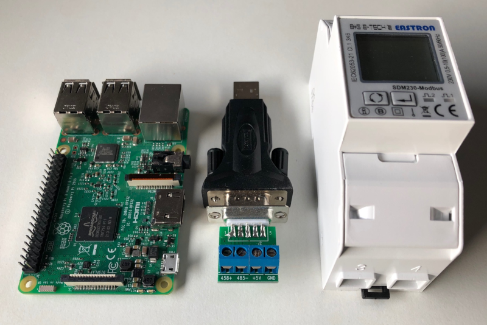
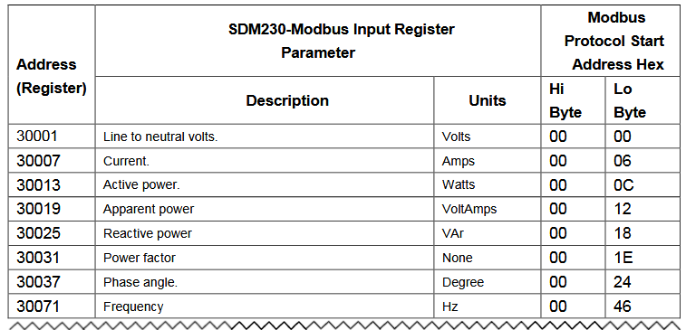
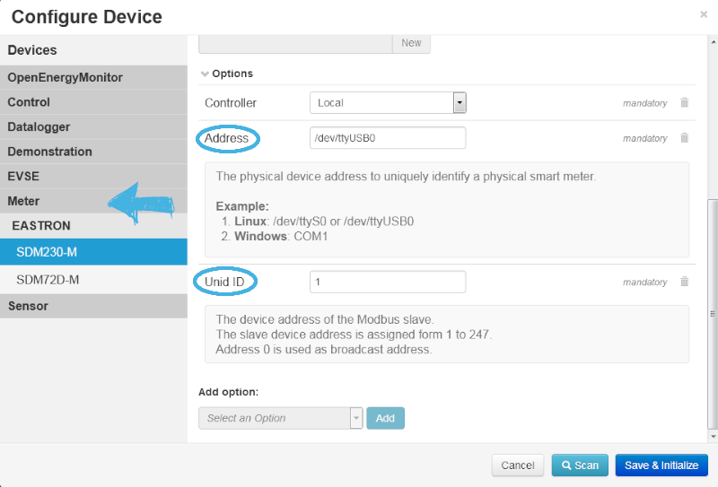
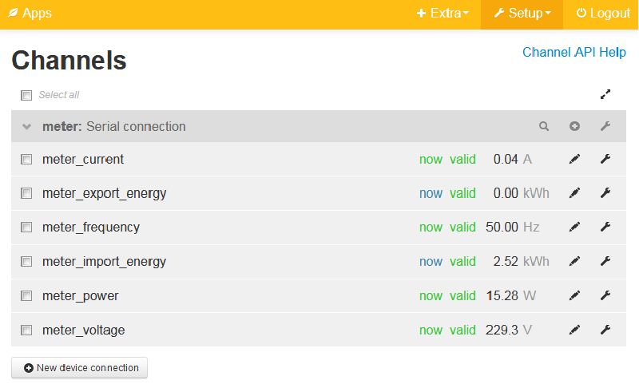

This document describes the configuration and control of a Modbus Single Phase Energy Meter with emonmuc (**E**nergy **mon**itoring **M**ulty **U**tility **C**ommunication controller).

---------------

**Please be aware, that working with the Modbus Energy Meter in the wrong way can cause death by high voltage! The guide given here has to be used at your own risk!**

# 1 About the Modbus protocol

To understand the numbering and addressing of the Modbus protocol and to be able to address the right register a short overview is given below. 

The Modbus protocol is based on a master/slave architecture. A master can be connected with several slaves.
The common used Modbus protocol is the RTU (Remote Terminal Unit) protocol. It has three layers. The first is the application layer, the second layer is the data link layer and the third is the physical layer, the RS485-interface.  
The data is getting transferred binary and is seperated to other datatelegrams through an intermission P. It has to be at least 3.5 signs long. The space inside the telegram has to be shorter than 1.5 sings.   

Each data link has an "A" (positive RS-485 communication port), "B" (negative RS-485 communication port) and GND port. To be able to serially read several slaves, the ports have to be connected and attached to the master. The master is authorized to adress the slaves to read out data. 

To adress the data, the Modbus-RTU-protocol clusters the different data types according to their references. The numbering of the registers starts at 1, the adressing starts at 0. The reference 3xxxx is implied.
An example: If you want to adress the register 30143 you use the adress 142. This is important to be able to read the correct data of the electricity meters. 

A detailed list of the registers for the SDM230-Modbus from Eastron we use here can be looked up in the [operations manual](https://bg-etech.de/download/manual/SDM230-register.pdf) at pages 2 and 3.

# Assembling the hardware

First assemble the SDM230 Modbus Single Phase Energy Meter using a male and a female connector. Then plug in a device you want to have measured, i.e. your laptop. 
Then plug the whole construction in a socket and check the Meter, if it is working. After booting the Modbus Energy Meter shows a testimage, the current firmware version, the Modbus ID, the baud rate and after that the measuring menu. 
The last thing you need is a converter to transfer the data measured to the Raspberry. The one we use is a USB to serial RS485 converter from Digitus. 
Then simply connect the converter to the Energy Meter via a three strings cable and plug in the converter into an USB slot of the raspberry. 

# Preparing the Raspberry

For the data transfer to be functional, the serial port must be prepared. If this hasn't happend so far, go to the [Serial Port tutorial](https://github.com/isc-konstanz/emonmuc/blob/docs/docs/LinuxSerialPort.md).

After that, download the driver

~~~
emonmuc install modbus
~~~

To disable the driver use

~~~
emonmuc remove modbus
~~~

Now create a new device and select **Meter > EASTRON > SDM230-M**. Choose a key and a desription as you like. In options you mandatorily have to name the adress and the Unid ID. By clicking at these points an explanation opens and shows a few possibilities. In our example we use as an adress the /dev/ttyUSB0 because we connect via USB, not with the UART pins of the Raspberry.
The UnidID in our case is 1 and can be found out when activating the Energy Meter as said in the beginning.
When done click **Save & Initialize**

Go to Channels and have a look if the Energy Meter is getting some values. The values are getting measured every minute so be a bit patient. Also check in the Channels config-Menue wether the baud rate of the Energy Meter and the one given in the default settings are the same. When everything has been done correcty, the Channels view should look something like this: 

