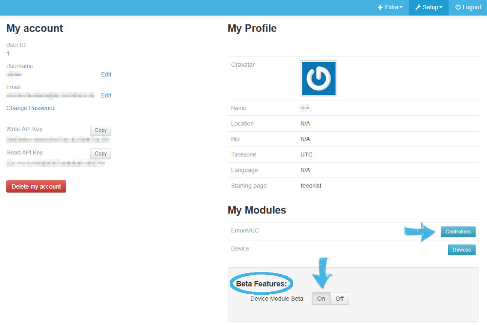
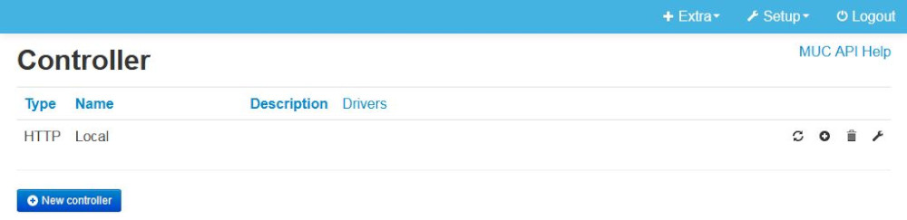

This document describes how to install emonmuc (**e**nergy **mon**itoring **m**ulty **u**tility **c**ommunication), an open-source protocoll driver project to enable the communication with a variety of metering or other devices, developed based on the [OpenMUC](https://www.openmuc.org/) project.

---------------

# 1 Install emoncms

First, the emoncms webserver needs to be installed and running.  
The project provides detailed installation guides for several platforms. Recommended for this guide are Linux oriented instructions:

- [Ubuntu / Debian Linux via git](https://github.com/emoncms/emoncms/blob/master/docs/LinuxInstall.md)
- [Raspbian Stretch](https://github.com/emoncms/emoncms/blob/master/docs/RaspberryPi/readme.md)

---------------

# 2 Install emonmuc

First, create some necessary directories for the installation and data and set the right permissions

~~~
sudo mkdir -p /var/{lib,run}/emonmuc /var/log/emoncms
sudo chown pi /var/{lib,run}/emonmuc /var/log/emoncms
~~~

Now, the framework can be downloaded either via git or simply copied into a directory like `/opt/emonmuc`.  
Git is a source code management and revision control system, but here it is used to download and update the emonmuc application. After downloading, the right permissions need to be set:

~~~
sudo git clone -b stable https://github.com/isc-konstanz/emonmuc.git /opt/emonmuc
sudo chown pi -R /opt/emonmuc
~~~

## 2.1 System service

To provide the comfortable starting, stopping or automatic execution at boot, a systemd service is provided to install:

~~~
sudo ln -s /opt/emonmuc/lib/systemd/emonmuc.service /lib/systemd/system/emonmuc.service
sudo systemctl enable emonmuc.service
~~~

With `/var/run/emonmuc` being located in a tmpfs and not created automatically at boot, this needs to be taken care of, for the service to work properly.
This will be handled by systemds' service **tmpfiles**, which can be configured in `/usr/lib/tmpfiles.d/`:

Create the configuration file *emonmuc.conf*

~~~
sudo nano /usr/lib/tmpfiles.d/emonmuc.conf
~~~

and add the line
>     d /var/run/emonmuc 0755 pi root -

The application will now start at boot and can be started with

~~~
sudo systemctl start emonmuc
~~~

as well as other systemctl commands *[start|restart|stop|status]*

## 2.2 System script

Emonmuc provides a run-script, allowing the framework to be configured, started and stopped comfortably via bash shell commands.

Link this script to the systems binaries to be executed comfortably:

~~~
sudo ln -s /opt/emonmuc/bin/emonmuc /usr/local/bin/emonmuc
~~~

**After a reboot or logout**, several basic commands are available:

 - Start the framework: `emonmuc start`
 - Stop the framework: `emonmuc stop`
 - Restart the framework: `emonmuc restart`
 - Reload configuration: `emonmuc reload`

If desired, the framework may be started in the foreground, by passing the option **-fg**

~~~
emonmuc start -fg
~~~

Further, the script allows the configuration of apps, drivers, or other bundles, registered to the framework.

## 2.3 Emoncms modules

To enable the comfortable configuration of e.g. metering devices for enabled protocol drivers via emoncms, the designated emoncms module needs to be linked to the emoncms modules dir

~~~
sudo chown www-data:root -R /opt/emonmuc/www/Modules
sudo -u www-data ln -s /opt/emonmuc/www/modules/muc /var/www/emoncms/Modules/
sudo -u www-data ln -s /opt/emonmuc/www/modules/channel /var/www/emoncms/Modules/
~~~

**Check for Database upates in the Administration pane, for the necessary tables to be created**

## 2.4 Emonmuc settings

If emonmuc was installed in a custom directory, its location should be configured in the emoncms settings. Open `/var/www/emoncms/settings.php` in an editor and add the lines, pointing to the specific location: 
   >     // Emonmuc module
   >     $muc_settings = array(
   >         'rootdir' => "/home/pi/emonmuc"
   >     );

For some configurations, the settings may be necessary to be adjusted. All settings can be found in the emoncms.conf.
Defaults for all parameters can be found in `emoncms.default.conf`.

~~~
nano /opt/emonmuc/conf/emoncms.conf
~~~

- The web servers location may be updated. By default, it is commented and points to an emoncms sever at localhost, e.g. VPN addresses or the remote emoncms.org server can be a valid selection though.  
   >     # URL of emoncms web server, used to post data
   >     address = https://emoncms.org/

- A default authentication for emoncms may be configured. While each data channel can be configured to have its own credentials, it may be preferable to group them with the same authentication, as this improves bulk posting and hence reduced traffic.  
To do this, **uncomment the lines** related to authorization and authentication, and enter the users Write Api Key  
   >     # API Key credentials to authorize communication with the emoncms webserver
   >     authorization = WRITE
   >     authentication = <apiKey>

- The maximum allowed threads for the emoncms logger to post values simultaniously to the specified webserver may be configured, if the configured server and the platform supports or needs higher traffic  
   >     # Set the maximum amount of HTTP requests running asynchronously. Default is 1
   >     maxThreads = 10

---------------

# 3 Prepare the Serial Port

To use any serial port with the emonmuc framework, e.g. to communicate via Modbus RTU, the open-source project [jRxTx](https://github.com/openmuc/jrxtx) is used. This, as well as some additional steps if the UART Pins of the Raspberry Pi Platform should be used, need to be prepared.  
The [Serial Port preparation guide](LinuxSerialPort.md) may be followed to do so.

---------------

# 4 Setup

With both components installed and running, the OpenMUC framework needs to be registered to the emoncms user. This can be done in the **Controllers** page, accessible at the users **My Account** from the menu.

Further, it is recommended to use the Beta version, as well as the emoncms [device module](https://github.com/emoncms/device), to improve the usability of the platform.  
Click **New controller** and confirm the default settings, if the framework is running on the same machine.

Energy meters and other utility devices connected to the platform can now be configured in the **Channels** site.

To learn about the features of EmonMUC, a [First Steps guide](FirstSteps.md) was documented and may be followed.
